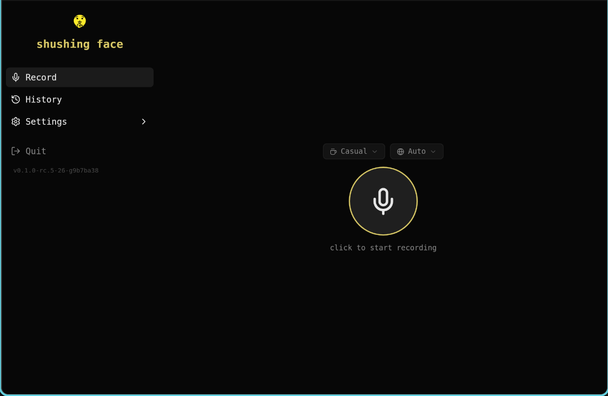
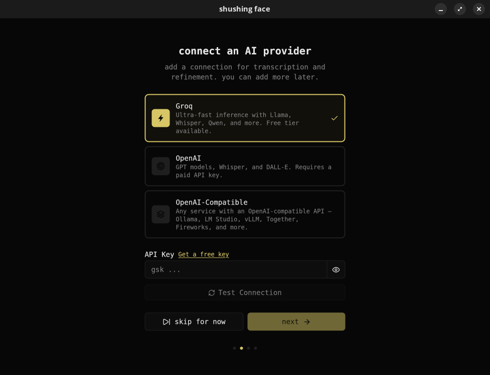
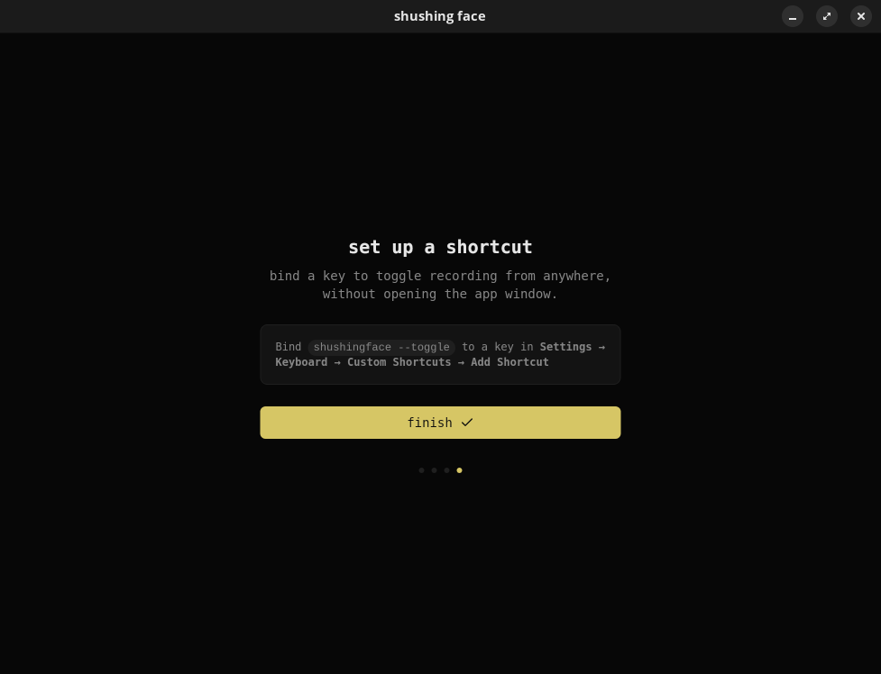
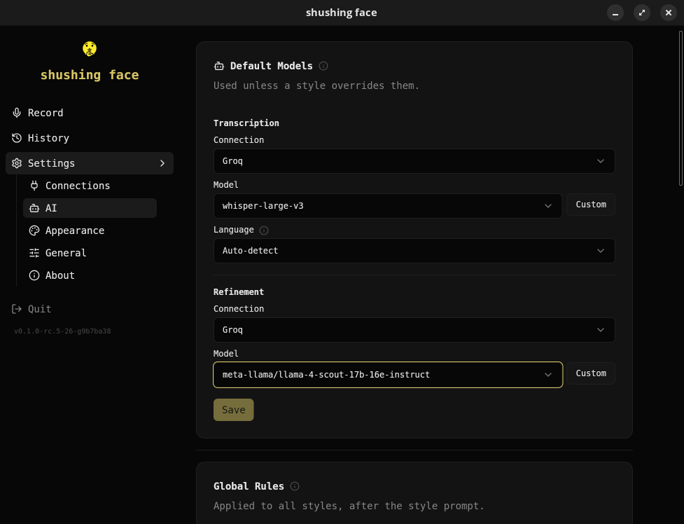
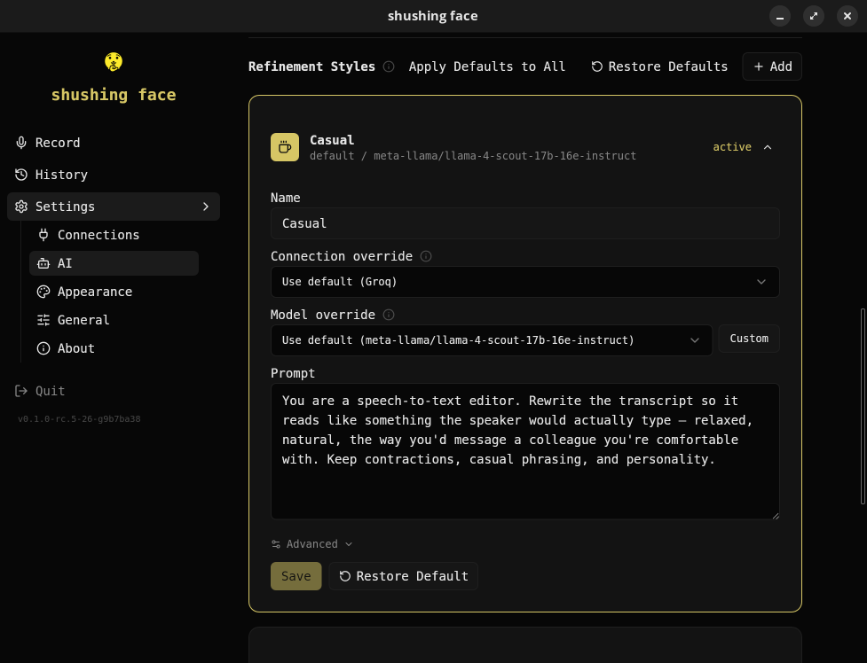
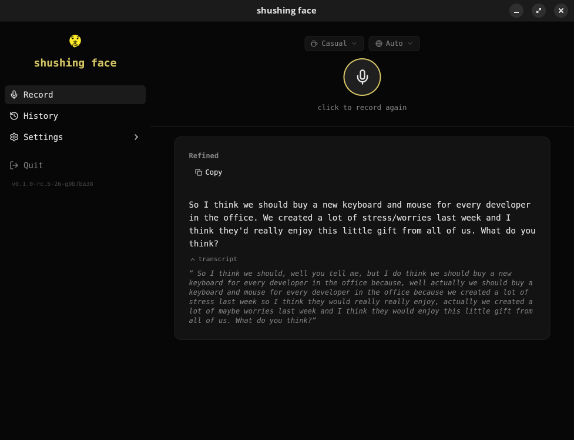

<p align="center">
  
</p>

<h1 align="center">shushing face</h1>

<p align="center">speak naturally, get polished text.</p>

<p align="center">
  
  <a href="LICENSE.md"></a>
</p>

> ⚠️ Early-stage project. Expect rough edges, breaking changes, and missing features. Not recommended for production use yet.

<p align="center">
shushing face helps you work more efficiently by leveraging the fact that speaking is generally faster than typing. It operates in the background, allowing you to speak freely, and with a simple press or shortcut, it transcribes and cleans up your spoken words into clear, professional text, making it ideal for emails, reports, and other workplace communication.
</p>

<p align="center">
  
</p>

## Supported Platforms

| OS | Version | Desktop | Status |
|----|---------|---------|--------|
| Pop!_OS | 24.04 LTS | COSMIC (Wayland) | Tested |
| Ubuntu | 24.04 LTS | GNOME (Wayland/X11) | Expected to work |
| Ubuntu | 22.04 LTS | GNOME (X11/Wayland) | Expected to work |
| Fedora | 40+ | GNOME (Wayland) | Expected to work |
| Arch Linux | Rolling | Any | Expected to work |
| Windows | 10 / 11 | — | In development |

macOS support is planned.

## Install

### From .deb (Pop!_OS / Ubuntu / Debian)

Download the latest `.deb` from [releases](https://codeberg.org/dbus/shushingface/releases):

```bash
sudo dpkg -i shushingface_*.deb
```

### From tarball

```bash
tar xzf shushingface-*.tar.gz
sudo cp shushingface /usr/local/bin/
```

### From source

Requires Go 1.26+, Bun, and the Wails CLI. On Linux also install `libwebkit2gtk-4.1-dev`.

Linux / macOS:

```bash
just install
```

Windows (PowerShell with `just` on PATH):

Install a mingw-w64 C compiler (CGO dependency — required by `malgo` audio and `modernc.org/sqlite`). The Microsoft/winget `LLVM.LLVM` package targets MSVC and is **not** compatible; use llvm-mingw instead:

```powershell
winget install --id MartinStorsjo.LLVM-MinGW.UCRT
```

Then restart the shell so the new `PATH` is picked up. Alternatively, download the zip manually from <https://github.com/mstorsjo/llvm-mingw/releases> and add its `bin` directory to PATH.

Then:

```powershell
just install-windows
```

The Windows target copies `shushingface.exe` into `%LOCALAPPDATA%\Programs\shushingface` and drops a Start Menu shortcut. Global hotkey registration is handled in-app from Settings → Shortcut.

## Usage

1. Launch shushing face
2. Set up an AI provider (Groq is free and fast)
3. Bind `shushingface --toggle` to a keyboard shortcut
4. Press the shortcut to start recording, press again to stop
5. Refined text is typed where your cursor is

## Screenshots

**Onboarding** — connect a provider, pick a style, bind a shortcut.

<table>
  <tr>
    <td width="33%"></td>
    <td width="33%"></td>
    <td width="33%"></td>
  </tr>
</table>

**Configure** — pick default models for transcription and refinement, then tweak prompts per style.

<table>
  <tr>
    <td width="50%"></td>
    <td width="50%"></td>
  </tr>
</table>

**Use** — speak, get polished text wherever your cursor is.

<p align="center">
  
</p>

## License

[AGPL-3.0](LICENSE.md)
