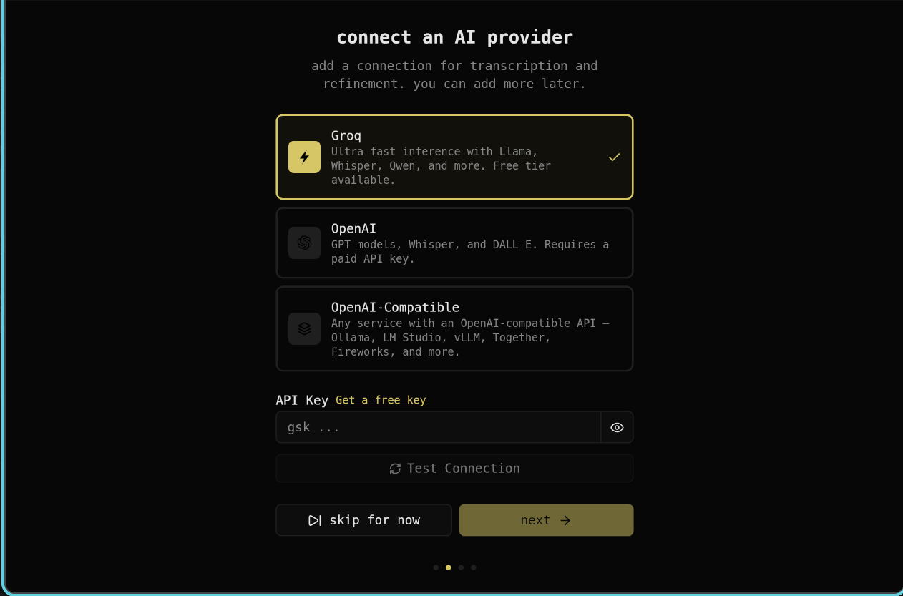
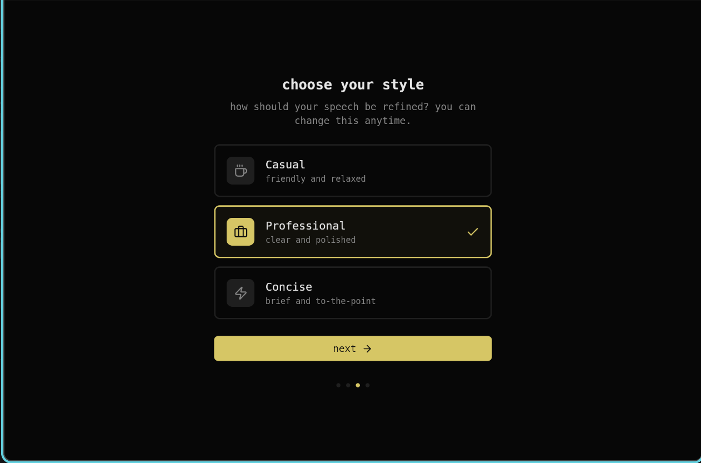
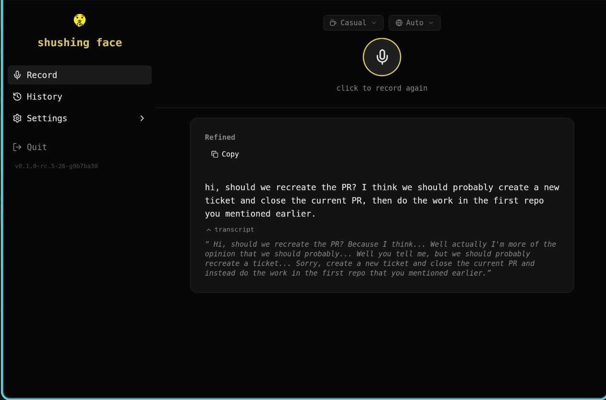
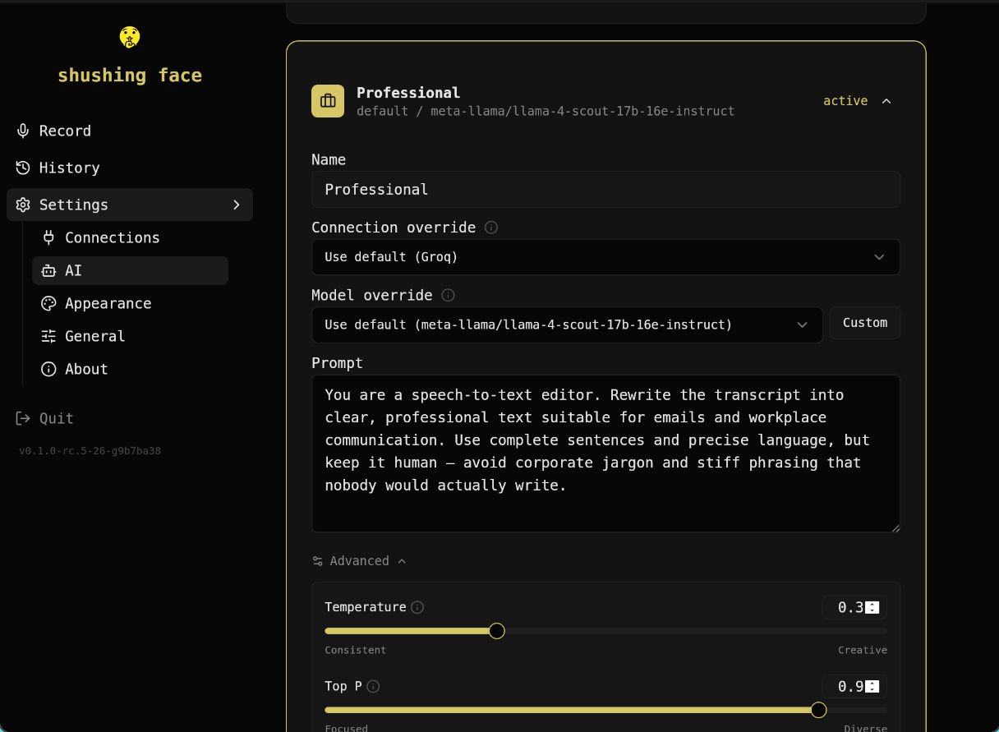

<p align="center">
  
</p>

<h1 align="center">shushing face</h1>

<p align="center">speak naturally, get polished text.</p>

<p align="center">
shushing face records your voice, transcribes it with AI, rewrites it into clean text, and types it right where your cursor is.
</p>

<p align="center">
  
</p>

## Supported Platforms

| OS | Version | Desktop | Status |
|----|---------|---------|--------|
| Pop!_OS | 24.04 LTS | COSMIC (Wayland) | Tested |
| Ubuntu | 24.04 LTS | GNOME (Wayland/X11) | Expected to work |
| Ubuntu | 22.04 LTS | GNOME (X11/Wayland) | Expected to work |
| Fedora | 40+ | GNOME (Wayland) | Expected to work |
| Arch Linux | Rolling | Any | Expected to work |

macOS and Windows support is planned.

## Install

### From .deb (Pop!_OS / Ubuntu / Debian)

Download the latest `.deb` from [releases](https://codeberg.org/dbus/shushingface/releases):

```bash
sudo dpkg -i shushingface_*.deb
```

### From tarball

```bash
tar xzf shushingface-*.tar.gz
sudo cp shushingface /usr/local/bin/
```

### From source

Requires Go 1.26+, Bun, and `libwebkit2gtk-4.1-dev`:

```bash
just install
```

## Usage

1. Launch shushing face
2. Set up an AI provider (Groq is free and fast)
3. Bind `shushingface --toggle` to a keyboard shortcut
4. Press the shortcut to start recording, press again to stop
5. Refined text is typed where your cursor is

## Screenshots

<table>
  <tr>
    <td width="50%"></td>
    <td width="50%"></td>
  </tr>
  <tr>
    <td><b>Connect a provider</b><br>Groq, OpenAI, or any OpenAI-compatible endpoint.</td>
    <td><b>Pick a style</b><br>Casual, Professional, or Concise — switch anytime.</td>
  </tr>
  <tr>
    <td></td>
    <td></td>
  </tr>
  <tr>
    <td><b>Bind a shortcut</b><br>Trigger recording from anywhere with a keybind.</td>
    <td><b>Speak, paste</b><br>Refined text appears wherever your cursor is.</td>
  </tr>
  <tr>
    <td colspan="2"></td>
  </tr>
  <tr>
    <td colspan="2"><b>Customize</b><br>Edit prompts, override the model, tune temperature per style.</td>
  </tr>
</table>

## License

[AGPL-3.0](LICENSE.md)
