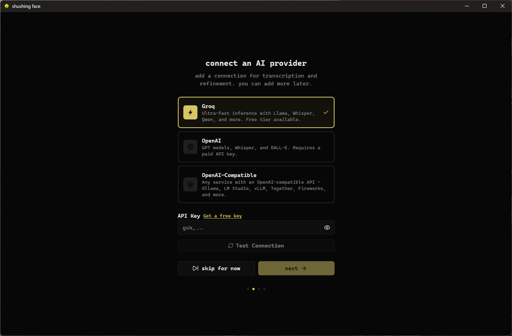
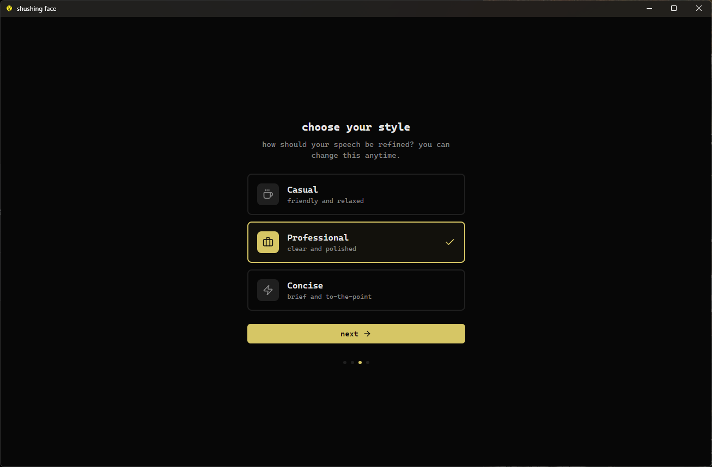
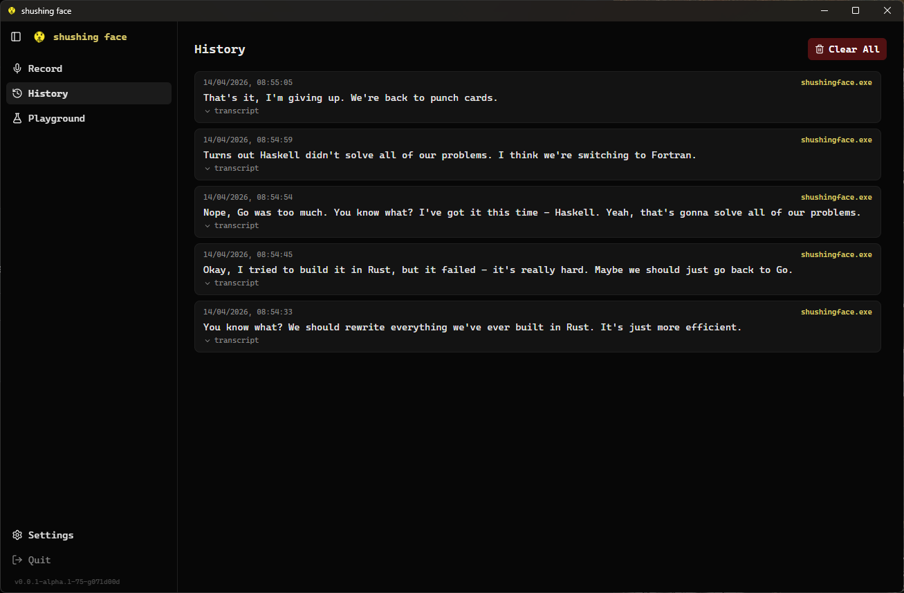
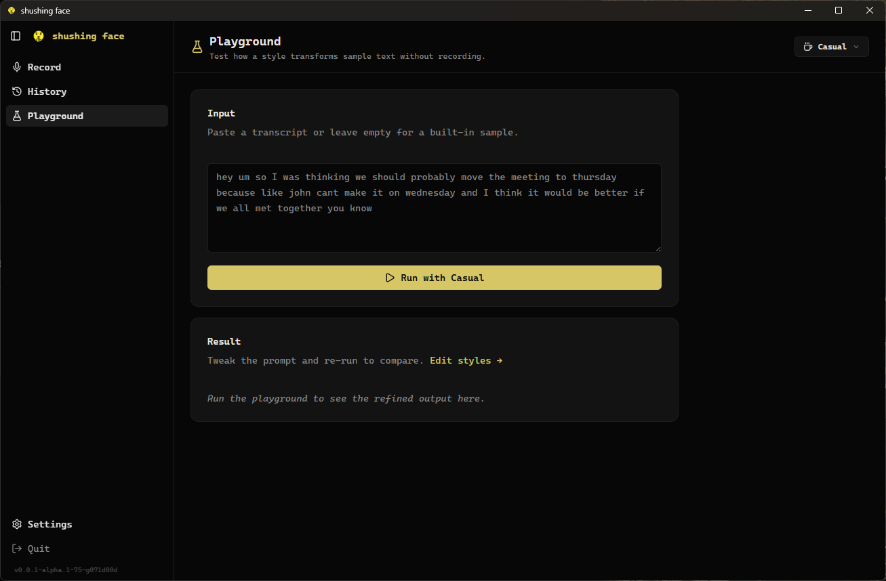
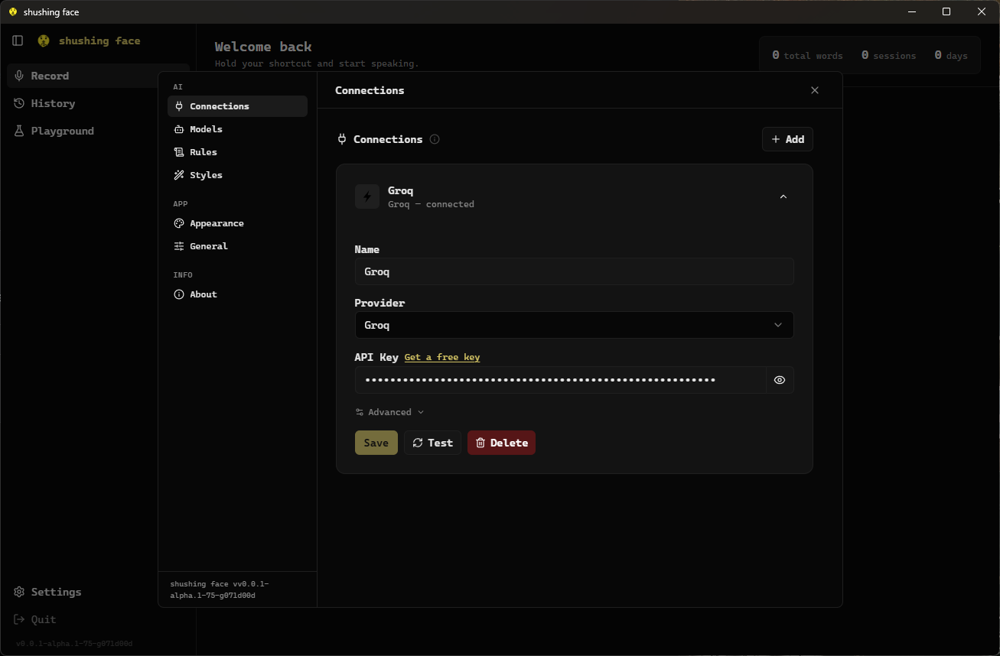
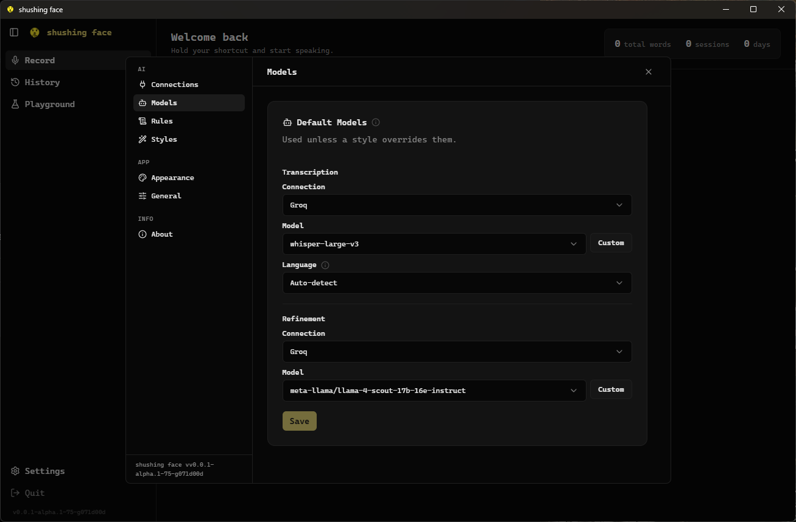
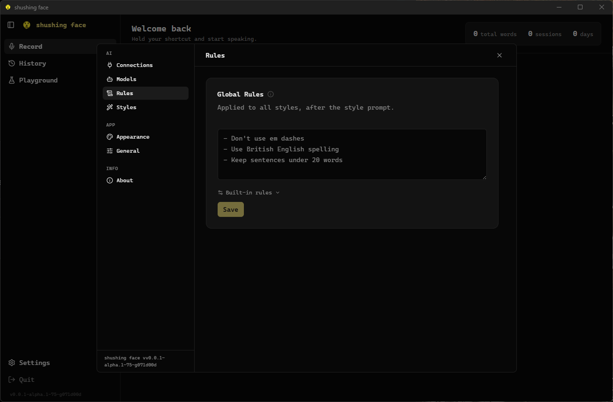
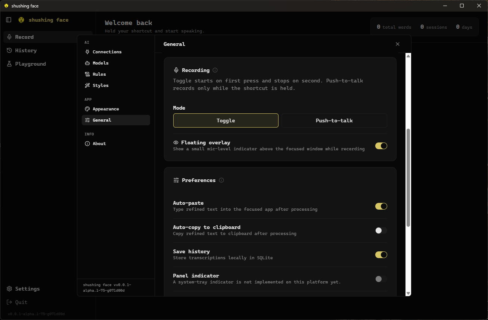

<p align="center">
  
</p>

<h1 align="center">shushing face</h1>

<p align="center">speak naturally, get polished text.</p>

<p align="center">
  
  <a href="LICENSE.md"></a>
</p>

> ⚠️ Early-stage project. Expect rough edges, breaking changes, and missing features. Not recommended for production use yet.

<p align="center">
shushing face helps you work more efficiently by leveraging the fact that speaking is generally faster than typing. It operates in the background, allowing you to speak freely, and with a simple press or shortcut, it transcribes and cleans up your spoken words into clear, professional text, making it ideal for emails, reports, and other workplace communication.
</p>

<p align="center">
  
</p>

## Supported Platforms

| OS | Version | Desktop | Status |
|----|---------|---------|--------|
| Pop!_OS | 24.04 LTS | COSMIC (Wayland) | Tested |
| Windows | 10 / 11 | — | Tested |
| Ubuntu | 24.04 LTS | GNOME (Wayland/X11) | Expected to work |
| Ubuntu | 22.04 LTS | GNOME (X11/Wayland) | Expected to work |
| Fedora | 40+ | GNOME (Wayland) | Expected to work |

## Install

### From a release artifact

Download the latest build from [releases](https://codeberg.org/dbus/shushingface/releases):

- **Pop!_OS / Ubuntu / Debian**: `sudo dpkg -i shushingface_*.deb`
- **Other Linux**: extract `shushingface-*.tar.gz` and copy `shushingface` onto your `PATH`
- **Windows**: run the NSIS installer

### From source

```bash
just doctor      # report missing dependencies
just bootstrap   # install missing dependencies (use --yes to skip prompts)
just dev         # run in dev mode
just install     # build + install for the current user
```

The same three commands work on Linux and Windows. Install locations
follow each OS's convention:

- Linux: binary under `$HOME/.local/bin/` (override with `PREFIX=...`),
  desktop entry + icon under `$HOME/.local/share/`
- Windows: binary under `%LOCALAPPDATA%\Programs\shushingface\` plus a
  Start Menu shortcut

Runtime files also live in OS-standard locations:

| | Linux | Windows |
|---|---|---|
| Config | `$XDG_CONFIG_HOME/shushingface/config.json` (default `~/.config`) | `%APPDATA%\shushingface\config.json` |
| Logs + history DB | `$XDG_STATE_HOME/shushingface/` (default `~/.local/state`) | `%LOCALAPPDATA%\shushingface\` |

### Packaging (maintainers)

`just package` produces installable artifacts for the current OS:

- Linux: `dist/shushingface-<version>-linux-amd64.tar.gz` and `dist/shushingface_<version>_amd64.deb`
- Windows: NSIS installer in `dist/`

## Usage

1. Launch shushing face
2. Set up an AI provider (Groq is free and fast)
3. Set your global shortcut in **Settings → General → Recording** (on Linux, `just install` also registers a system-wide Super+Ctrl+B binding)
4. Press the shortcut to start recording, press again to stop
5. Refined text is typed where your cursor is

## Screenshots

<details>
<summary><strong>Onboarding</strong> — connect a provider and pick a refinement style</summary>

<br>





</details>

<details>
<summary><strong>Main views</strong> — record, browse history, test prompts in the playground</summary>

<br>






</details>

<details>
<summary><strong>Settings</strong> — connections, models, rules, and general preferences</summary>

<br>









</details>
